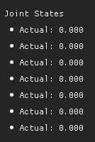

# holiday-robot-jog


## Installation (when not using docker)
```
pip install dearpygui==2.0.0
```

## RUN robot jog
```
python robot_jog.py --num_joints 7 --pub_topic_name /arm/target_joint_state --sub_topic_name_joint /arm/joint_state --sub_topic_name_cart /hday/engine/motion_planner/end_effector_poses --len_histories 1000 --end_effector_link hand_mount_link
```
- num_joints: joint 개수
- pub_topic_name: publish하고자 하는 topic 이름
- sub_topic_name_joint: subscribe하고자 하는 joint topic 이름
- sub_topic_name_cart: subscribe하고자 하는 cartesian topic 이름 (from hday_motion_planner_msgs.msg import CartesianState)
- len_histories: plot시 그릴 history 길이
- end_effector_link: motion planner command의 delta cartesian command 사용시 움직이고자 하는 link (semantic에 정의되어 있어야함)

## RUN motor jog
```
python motor_jog.py --num_joints 7 --pub_topic_name /arm/target_positions --sub_topic_name /arm/motor_positions --len_histories 1000
```

## How to use robot jog

	
- select joint
  
  
    
    - 조인트를 하나 선택 후 키보드 위아래를 누르면 0.05rad 단위로 값을 변화시킬 수 있다
    - 누른 조인트는 상자색이 변하며 한번더 누르면 비활성화 된다
    - 다른 조인트를 누르면 그 외의 조인트는 모두 자동 비활성화 된다

- sinusoidal motion

  

    - magnitude와 omega는 값 입력도 가능하고 +/-로 0.1단위로 조절 가능하다
    - magnitude, omega 설정 후 sin이 써져있는 조인트를 선택하면 현재값을 기준으로 sin파형으로 움직이는 모션을 생성한다
    - 버튼을 해제하거나 joint 혹은 다른 sin joint 버튼을 선택하면 해당 조인트 움직임은 끝난다 

- joint command

  

    - slider에서 위치를 클릭해서 값 보내는게 가능하다 (-3.14rad ~ 3.14rad)
    - linear interpolation으로 값을 생성하며 joint_vel은 0.2rad/s이다
    - slider옆에 값을 입력해도 된다
    - +/-로도 0.1단위로 값 증가/감소가 가능하다

- joint state

  

    - 현재 robot joint state가 표시된다
    - sub_topic_name_joint으로 sub이 안될 경우 jog는 켜지지 않는다

- joint effort

  

    - 각 축별 effort 세팅이 가능하다
    - effort all을 수정하면 모든 joint effort가 같이 수정된다
    - 값을 입력할 수 있고, +/1로 0.1단위로 조절이 가능하다

- publishing control

  

    - pub 시작/정지가 버튼으로 가능하다
    - 시작은 space bar로, 정지는 esc로도 가능하다
    - publish hz를 입력할 수 있으며 +/-로 10단위로 수정이 가능하다
    - publish hz입력 하는 곳 아래에 실제 pub hz가 표시된다

- motion planner command

  

    - https://github.com/Holiday-Robot/holiday-manipulation-engine 안의 motion_planner를 키면 연동이 가능하다
    - zero를 누르면 모든 joint가 0인 위치로 planning해서 이동한다
    - cartesian position delta값을 입력할 수 있고 +/-로 0.01m단위로 조절이 가능하다
    - +x, -x, +y, -y, +z, -z로 cartesian delta만큼 이동할 수 있다.
    - cartesian orientation delta값을 입력할 수 있고 +/-로 0.01rad단위로 조절이 가능하다
    - +roll, -roll, +pitch, -pitch, +yaw, -yaw로 cartesian position/orientation delta만큼 이동할 수 있다.
    - orientation은 body frame 기준으로 delta이동이다.